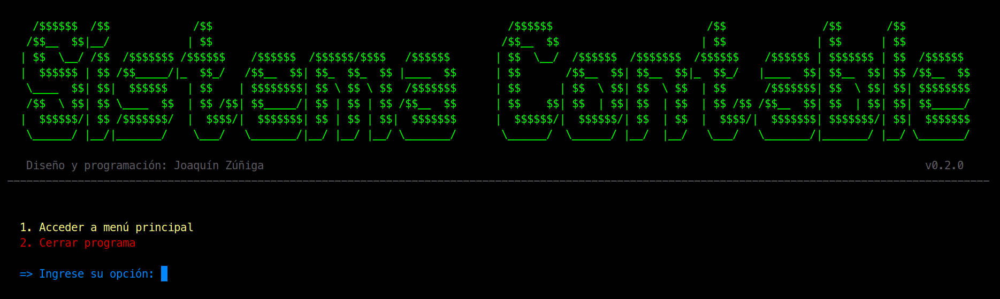
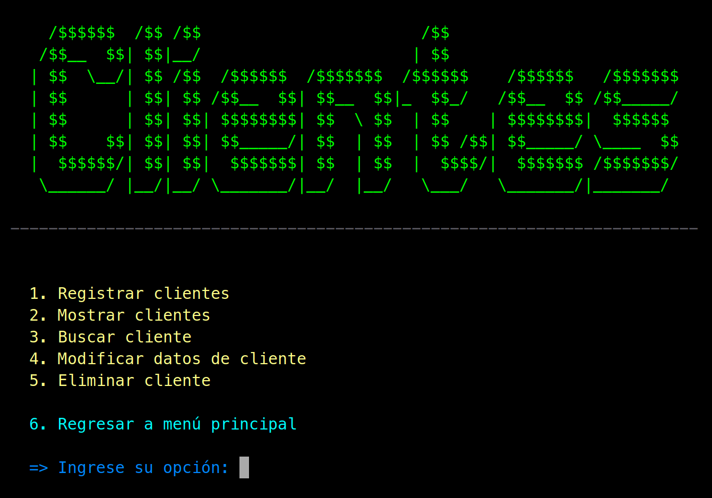
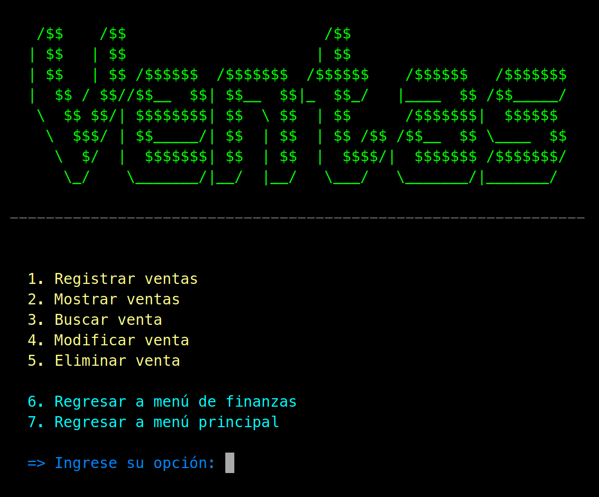

# Sistema Contable

Aplicación de terminal para manejar la contabilidad de una tienda pequeña.



> *Nota: Este sistema fue entregado como proyecto final para la asignatura Lógica y Algoritmos en junio, 2024. Decidí mejorar el formato y la organización del código para mejorar su legibilidad antes de publicarlo.*

---

### Módulos

###### 1. Gestión de Clientes:

Permite almacenar, visualizar, buscar y eliminar clientes, quienes son identificados por un ID, su nombre, su dirección e información de contacto.



###### 2. Gestión de Ventas:

A la hora de registrar una venta, se requiere un ID, la fecha, el nombre del cliente, la cantidad del producto comprado y el monto de la venta. Para poder calcular el monto, se requiere que el usuario haya especificado el precio por unidad previamente; el monto de una venta se calcula automáticamente con este cuando se ingresa la cantidad comprada en una venta. Adicionalmente, se le pregunta al usuario si el cliente ya pagó el monto. Si no se ha pagado, la venta se agrega al registro de pagos pendientes. Igualmente, se implementan métodos de CRUD para interactuar con el registro.



###### 3. Gestión de Pagos Pendientes:

Los pagos pendientes solamente se pueden registrar si se especifica que una venta no se ha pagado. Se almacenan con los datos de la venta a la que corresponden: el ID, la fecha, el nombre del cliente y el monto de la venta. En el menú de este módulo, no se permite registrar; solamente se pueden mostrar y eliminar pagos pendientes. Cuando uno se elimina, el registro de venta al que corresponde se actualiza para reflejar que el cliente ya pagó.


###### 4. Gestión de Costos Fijos:

Para registrar los costos fijos, se le pide al usuario un ID, el monto del costo y una pequeña descripción. Igual que los otros menus, también se pueden mostrar, buscar, editar y eliminar costos.


###### 5. Gestión de Costos Variables:

El módulo de costos variables es igual al de costos fijos; la única diferencia es que a la hora de registrar un costo variable, también se le pide al usuario el mes al que corresponde el costo.


###### 6. Cálculo de Totales:

El sistema permite calcular los totales de todos los montos que ha registrado el usuario. A la hora de calcular ingresos, se suman los montos de todas las ventas del mes actual. Similarmente, cuando se calculan los costos totales, solamente se suman los costos variables del mes actual.


---

### Compilación

```
g++ main.cpp src/calculos.cpp src/clientes.cpp src/costos.cpp src/menus.cpp src/pendientes.cpp src/precio.cpp src/titulos.cpp src/util_funcs.cpp src/ventas.cpp -Iheaders -o main
```

```
clang++ main.cpp src/calculos.cpp src/clientes.cpp src/costos.cpp src/menus.cpp src/pendientes.cpp src/precio.cpp src/titulos.cpp src/util_funcs.cpp src/ventas.cpp -Iheaders -o main
```

> *Cuando estaba creando este sistema, no sabía utilizar herramientas de build como Make y Cmake. Aún así, debido a la simplicidad del proyecto, decidí que no era necesario manejarlo con Cmake a la hora de revisarlo y reorganizarlo.*

---

### Estadísticas


---

### Créditos

* *[patorjk.com](http://patorjk.com/software/taag/):* Utilizado para crear el arte ASCII de los menús, con el font "BigMoney-ne". El arte generado para "Menú Principal" fue modificado para agregar el tilde de la u.
* *[LemonLib](https://github.com/sea2horses/LemonLib):* Utilizado como base para ```headers/colors.h```. El código de ```LemonLib/LemonLibCSB.h```, y su funcionalidad para darle colores al texto de un terminal utilizando códigos ANSI fue adaptada y simplificada para este proyecto.
